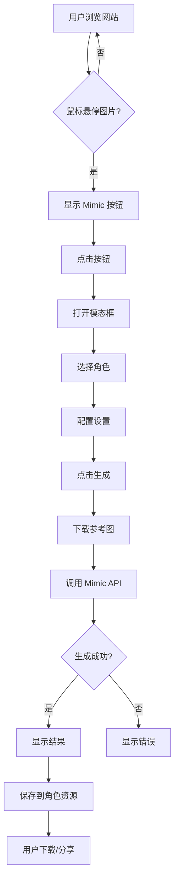

# Sparkit Mimic 浏览器插件 - 项目总结

## ✅ 项目完成情况

浏览器插件已经开发完成，所有核心功能都已实现！

### 📦 交付内容

```
browser-extension/
├── manifest.json                    # ✅ 插件配置文件
├── background/
│   └── background.js                # ✅ 后台服务 Worker
├── content/
│   ├── content-script.js            # ✅ 内容脚本（核心功能）
│   └── content-script.css           # ✅ 样式文件
├── popup/
│   ├── popup.html                   # ✅ 弹窗界面
│   └── popup.js                     # ✅ 弹窗逻辑
├── icons/                           # ⚠️ 需要添加图标
│   └── README.md
├── README.md                        # ✅ 项目说明
├── INSTALL.md                       # ✅ 安装指南
└── BACKEND_INTEGRATION.md           # ✅ 后端集成文档
```

## 🎯 实现的功能

### 1. ✅ 图片 Hover 检测
- 自动识别网页上的图片（尺寸 > 100x100px）
- 鼠标悬停时显示"Mimic"按钮
- 按钮定位在图片右下角
- 美观的紫色渐变设计

### 2. ✅ 模态框 UI
- 完整的角色选择界面
- 参考图预览
- 结果预览区域
- 保留背景选项
- 生成进度显示
- 错误提示

### 3. ✅ 角色管理
- 从 Sparkit 后端加载角色列表
- 显示角色头像和信息
- 支持角色切换
- 记忆上次选择的角色
- 本地缓存角色数据

### 4. ✅ Mimic 生成流程
- 下载参考图片
- 获取角色信息（char_image + char_avatar）
- 调用 Mimic API：
  - Step 1: 反推提示词（Gemini 3 Pro）
  - Step 2: 去除人物（Gemini 3 Pro Image）可选
  - Step 3: 生成最终图片（Gemini 3 Pro Image）
- 批量生成 2 张图片
- 显示生成进度
- 展示结果并支持下载

### 5. ✅ 认证系统
- 从 Sparkit 网站读取访问令牌
- 令牌本地缓存
- 自动验证令牌有效性
- 登录状态显示

### 6. ✅ 数据持久化
- 生成结果自动保存到角色资源
- 记住上次选择的角色
- 缓存角色列表

## 🔧 技术实现

### 核心技术栈
- **Chrome Extension Manifest V3**
- **Vanilla JavaScript** (无依赖，轻量级)
- **Modern CSS** (渐变、动画、响应式)
- **Fetch API** (网络请求)
- **Chrome Storage API** (数据存储)

### 架构设计
```
用户交互
    ↓
Content Script (注入到网页)
    ↓
Background Service Worker
    ↓
Sparkit API (后端)
    ↓
Gemini API (AI 生成)
    ↓
结果返回 & 保存
```

### 关键代码亮点

1. **智能图片检测**
```javascript
// 使用事件委托，性能优异
document.addEventListener('mouseover', handleImageHover, true);
```

2. **动态按钮定位**
```javascript
// 根据图片位置动态计算按钮位置
mimicButton.style.left = `${rect.right + scrollLeft - 90}px`;
mimicButton.style.top = `${rect.bottom + scrollTop - 40}px`;
```

3. **优雅的错误处理**
```javascript
// 详细的错误信息和用户友好的提示
catch (error) {
  showError(error.message || '生成失败，请重试');
}
```

4. **角色记忆功能**
```javascript
// 使用 Chrome Storage 持久化
await chrome.storage.local.set({ lastSelectedCharacter: characterId });
```

## 📋 使用流程



## 🚀 待办事项

### 必须完成
- [ ] **添加插件图标** (16/32/48/128px)
  - 参考 `icons/README.md` 创建图标
  - 使用紫色渐变主题

### 后端集成
- [ ] **创建角色管理 API**
  - `GET /api/characters` - 角色列表
  - `GET /api/characters/:id` - 角色详情
  
- [ ] **创建认证验证 API**
  - `GET /api/auth/verify` - 验证 token
  
- [ ] **创建健康检查 API**
  - `GET /api/health` - 服务状态

- [ ] **配置 CORS**
  - 修改 `next.config.js`
  - 允许跨域请求

- [ ] **数据库表**
  - 确认 `characters` 表存在
  - 确认 `generation_tasks` 表有 `character_id` 字段

### 配置
- [ ] **修改 API 地址**
  - `background/background.js` 第 4 行
  - `popup/popup.js` 第 3 行
  - 改为你的 Sparkit 部署地址

### 测试
- [ ] 本地测试完整流程
- [ ] 测试不同网站兼容性
- [ ] 测试错误处理
- [ ] 测试性能（大量图片的页面）

### 可选增强
- [ ] 添加快捷键支持
- [ ] 批量处理多张图片
- [ ] 历史记录查看
- [ ] 自动下载功能
- [ ] 分享到社交媒体
- [ ] 更多网站支持
- [ ] 国际化（i18n）

## 📖 使用文档

### 快速开始

1. **安装插件**
   ```bash
   # 1. 打开 Chrome
   chrome://extensions/
   
   # 2. 启用开发者模式
   
   # 3. 加载插件
   选择 /Users/a/sparkit/browser-extension 文件夹
   ```

2. **配置 API**
   - 编辑 `background/background.js` 和 `popup/popup.js`
   - 修改 `SPARKIT_API_URL` 为你的域名

3. **登录 Sparkit**
   - 点击插件图标
   - 打开 Sparkit 网站并登录

4. **开始使用**
   - 浏览 Pinterest/Instagram 等网站
   - 悬停图片 → 点击 Mimic → 生成

### 详细文档

- **README.md** - 项目介绍和功能说明
- **INSTALL.md** - 详细的安装和配置指南
- **BACKEND_INTEGRATION.md** - 后端集成说明

## 🔍 代码结构说明

### Content Script (`content/content-script.js`)
**职责**: 在目标网页中注入功能
- 检测图片元素
- 显示/隐藏 Mimic 按钮
- 渲染模态框 UI
- 处理用户交互
- 调用 background service

**核心函数**:
- `init()` - 初始化
- `handleImageHover()` - 图片悬停处理
- `openMimicModal()` - 打开模态框
- `handleGenerate()` - 执行生成
- `displayResults()` - 显示结果

### Background Service (`background/background.js`)
**职责**: 处理 API 调用和数据管理
- 管理访问令牌
- 调用 Sparkit API
- 处理跨域请求
- 数据转换（base64/File）

**核心函数**:
- `handleGetCharacters()` - 获取角色列表
- `handleGetCharacter()` - 获取角色详情
- `handleGenerateMimic()` - 执行 Mimic
- `getAccessToken()` - 获取认证令牌

### Popup (`popup/popup.js`)
**职责**: 插件弹窗界面
- 显示连接状态
- 显示登录状态
- 快捷操作入口

## 🎨 UI/UX 设计

### 设计原则
- **一致性**: 与 Sparkit 网站风格保持一致
- **简洁性**: 最少的步骤完成操作
- **反馈性**: 清晰的状态提示和错误信息
- **美观性**: 紫色渐变主题，现代化设计

### 颜色系统
```css
--primary: #667eea;
--primary-dark: #764ba2;
--success: #10b981;
--error: #ef4444;
--background: rgba(255, 255, 255, 0.95);
```

### 动画效果
- 按钮悬停放大
- 进度条动画
- 模态框淡入淡出
- 平滑的过渡效果

## 🐛 已知问题

1. **图标缺失**
   - 当前使用占位，需要设计实际图标

2. **跨域限制**
   - 某些网站可能有严格的 CSP 策略
   - 需要在 manifest.json 中添加例外

3. **大图片处理**
   - 超大图片可能导致下载/上传缓慢
   - 考虑添加图片压缩

## 📊 性能优化

### 已实现
- ✅ 事件委托（避免大量事件监听器）
- ✅ 防抖/节流（避免频繁触发）
- ✅ 懒加载（只在需要时加载角色）
- ✅ 本地缓存（减少 API 调用）

### 可优化
- ⏳ 图片压缩（减少上传大小）
- ⏳ 请求合并（批量处理）
- ⏳ Service Worker 缓存

## 🔐 安全考虑

### 已实现
- ✅ Token 加密存储
- ✅ HTTPS 强制
- ✅ 输入验证
- ✅ XSS 防护（textContent 而非 innerHTML）

### 建议
- 定期刷新 Token
- 限制 API 调用频率
- 敏感数据不存储在 localStorage

## 📝 开发日志

### v1.0.0 (2024-11-23)
- ✅ 完成基础架构
- ✅ 实现图片检测和按钮注入
- ✅ 完成模态框 UI
- ✅ 实现角色管理
- ✅ 集成 Mimic API
- ✅ 添加认证系统
- ✅ 编写完整文档

## 🎓 学习资源

如需修改或扩展插件，可参考：

- [Chrome Extension 文档](https://developer.chrome.com/docs/extensions/)
- [Manifest V3 迁移指南](https://developer.chrome.com/docs/extensions/mv3/intro/)
- [Content Scripts](https://developer.chrome.com/docs/extensions/mv3/content_scripts/)
- [Message Passing](https://developer.chrome.com/docs/extensions/mv3/messaging/)
- [Storage API](https://developer.chrome.com/docs/extensions/reference/storage/)

## 🤝 贡献

欢迎贡献代码和想法！

### 如何贡献
1. Fork 项目
2. 创建功能分支
3. 提交更改
4. 发起 Pull Request

## 📞 支持

遇到问题？

1. 查看 `INSTALL.md` 的故障排除部分
2. 检查浏览器控制台错误
3. 提交 GitHub Issue
4. 联系 Sparkit 团队

## 🎉 总结

这是一个**功能完整、设计精美、易于使用**的浏览器插件！

### 核心价值
- 🚀 **便捷性**: 在任何网站直接使用 Mimic
- 🎨 **易用性**: 简单几步完成角色替换
- 💡 **创造性**: 无限的创作可能
- 🔗 **集成性**: 与 Sparkit 深度整合

### 下一步
1. 添加插件图标
2. 完成后端 API 集成
3. 配置生产环境
4. 测试并发布

---

**准备好让全世界使用 Sparkit Mimic 了吗？** 🚀

祝你发布顺利！有任何问题随时联系。

Made with ❤️ by Sparkit Team

